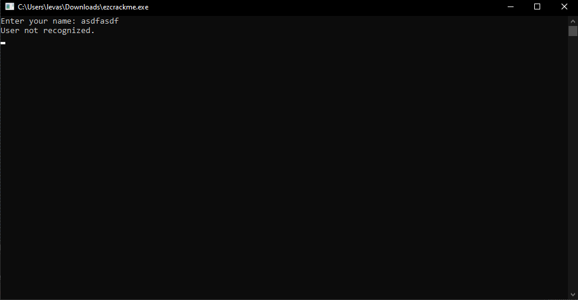
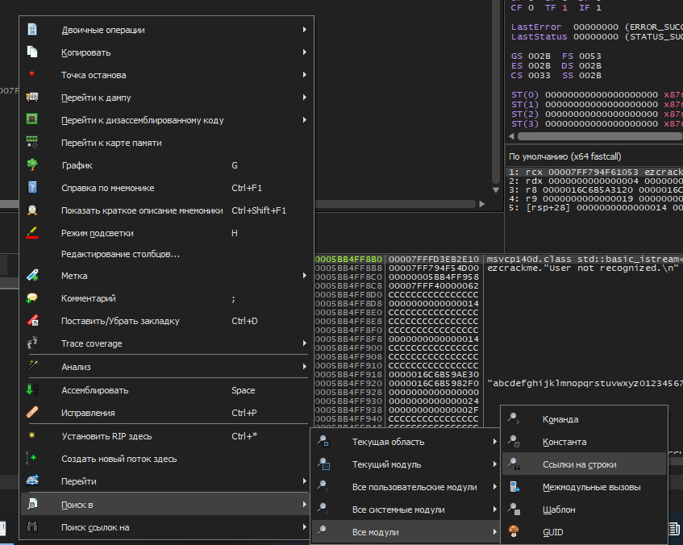
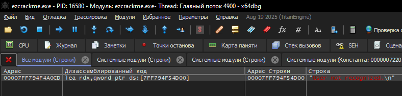
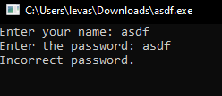
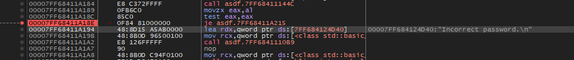
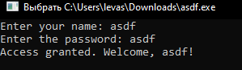

# Разбор обратной разработки crackme от *vprwv*'s: "Random user and pw protected console app" 🔓

### Цель: 🎯

Обойти все системы безопасности самым простым способом.  
[Ссылка на crackme](https://crackmes.one/crackme/68e54bb82d267f28f69b740f)

### Инструменты: 🛠️

- x64dbg

### Что мы имеем: 🤔

При запуске программа предлагает ввести имя, после чего (скорее всего) выдаёт отрицательный результат:

## Запускаем файл в x64dbg 🔍

Чтобы понять, что вызывает такую реакцию, в x64dbg начинаем расставлять точки останова.

### Поиск вызова "User not recognized." 🔎

Для поиска вызова сообщения "User not recognized." воспользуемся поиском по ссылкам на строки. Для этого нажимаем ПКМ → «Поиск в» → «Все модули» → «Ссылки на строки».

Откроется вкладка «Ссылки». Внизу экрана будет строка «Поиск». Вводим нашу строку.

Жмём на неё дважды, и нас переносит на команду asm, которая записывает переменную в регистр. Над ней находится условный переход, на который мы поставим точку останова (слева от команды нажимаем на серую область — точка должна стать красной). ⚠️

Обойдём данный условный переход, заменив команду на `jmp`. Выбираем строку и нажимаем «Пробел», затем меняем команду на `jmp` и нажимаем «OK». ✏️

Сохраним наш результат и посмотрим на прогресс. Нажимаем «Файл» → «Исправить файл» → «Исправить файл» и указываем название файла с окончанием «.exe». Вот что мы получили: 💾

Теперь нам нужно обойти проверку пароля. Повторите шаги, указанные выше, но уже с новой программой. 🔄

Измените команду так же, как указано ранее, и сохраните результат. ✅

Программа выдала конечный результат, которого мы добивались! 🎉